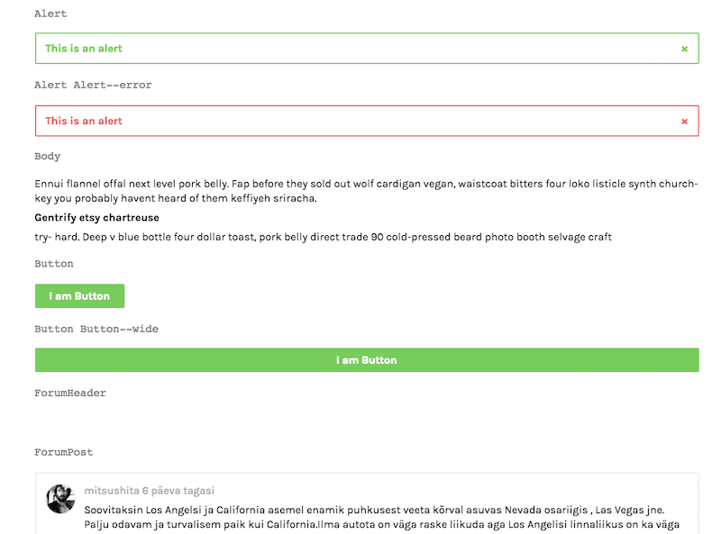

## About
 
The goal of this experiment is to clear up current view rendering mess and come up
with a solution with clearer data and control flow. Currently the view logic
is diffused into models, controllers, views and utility functions.

## Installation

```
cp .env.example .env
php artisan key:generate
composer install
npm install
gulp
php artisan serve # Unless using Laragon
```

In Ubuntu, add this:
```
sudo apt-get install libnotify-bin
```

## Architecture

The proposal is to introduce some MVVC and declarative programming ideas to view rendering.

Here are some core concepts:

#### 1. Models

Models work as previously but the presentational methods (truncated body texts etc) are moved out (see below).

Open questions:
* How to serve fallback content (no related posts, no content in particular destination tree level etc)? Consider ```ModelFinder``` class, see [this](https://laracasts.com/series/whatcha-working-on/episodes/3).


#### 2. Presenters

Presenters, essentialy ViewModels that augment the models with presenter methods, such as

```
Content::find(1)->vars()->bodyShort
```

Instead of canonical ```->vars()``` we consider simpler naming convention, such as

```
Content::find(1)->vars()->bodyShort
```

See [this screencast](https://laracasts.com/series/whip-monstrous-code-into-shape/episodes/11) for a reference.

Presenters can be stored next to models, such as ```ContentPresenter.php``` and can be delivered as traits.

Under discussion:

* Will views only receive model data via presenters / vars or can they access model attributes directly?


#### 3. Controllers

Controllers work as previously. Its recommended to have a minimal amount of view-related code in ```index``` and ```show``` methods (see the example below)


#### 4. Components



Components are wrappers around partial views that can be rendered via ```component()``` helper. Both Blade and VueJS components are supported,  ```component()``` helper abstracts away the difference calling them.

Blade components can be generated using

```sh
php artisan make:component ComponentName
```

Vue components can be generated using

```sh
php artisan make:component ComponentName --vue
```

Components are stored in ```resources/views/components``` directory and have a simple flat structure:

```yaml
- resources/views/components/Alert/Alert.vue
- resources/views/components/Alert/Alert.css
- resources/views/components/ProfileImage/ProfileImage.blade.php
- resources/views/components/ProfileImage/ProfileImage.css
- ...
```

Component API works as follows:

```php
component('MyComponent')
    ->is('small') // This used to be $modifiers variable
    ->is(collect(['orange', 'yellow'])->random()) // Can be chained and dynamic
    ->with('data1', 'Hello') // Same as view()->with()
    ->with('data2', 'World') // Can be chained
    ->show($request->user()->can('see-content')) // Or ->hide($request->user()->cannot('see-content'))
```

By using the following Blade template...

```handlebars

<!-- resources/views/components/MyComponent/MyComponent.blade.php -->

<div class="MyComponent {{ $isclasses }}">
  
    <div class="MyComponent__data1"> {{ $data1 }} </div>
 
    <div class="MyComponent__data2"> {{ $data2 }} </div>

</div>
```

...the component will be rendered into this HTML:

```html
<div class="MyComponent MyComponent--small MyComponent--orange">

    <div class="MyComponent__data1">Hello</div>
  
    <div class="MyComponent__data2">World</div>

</div>
```

Note that a hybrid **BEM** / **SUIT** naming convention is used. No strong opinions there, it is just useful when the new CSS naming convention differs visually from the old one so it makes the refactoring easier and makes the views mixing old and new components visually more parseable.

OK, back to the code. Here is an example with model, presenters, controller and nested components:

```php
// app/Http/Controllers/ContentStaticController.php

public function index() {

    $post = Content::whereType('static')->findOrFail($id);
    $photo = Content::getRandomFeaturedPhoto();

    return view('pages.content.static.show')
        ->with('header', component('Masthead')
            ->with('title', $post->vars()->title)
            ->with('image', $photo->vars()->headerImage)
        )
        ->with('content', [
            component('ListItem') // Something like row component used to be
                ->with('figure', component('ProfileImage')->with('user', $post->user)
                ->with('title', $post->vars()->title)
                ->with('subtitle', $post->vars()->meta)),
            component('Body')->with('body', $post->vars()->body)
        ])
        ->with('footer_promo', component('Promo')->is('inFooter'))
        ->with('footer', component('Footer')->with('menu', config('menu.footer')))

}
```

It feels a bit too much code for a controller. Lets try to move more complex and/or repeating parts away. 

Meet...

#### 5. Component groups

Component groups are similar to Laravel's [view composers](https://laravel.com/docs/5.2/views#view-composers), the are essentially ViewControllers that encapsulate certain complex or recurring component rendering.

The have many names, they can also be **Regions**, **Patterns**, **Modules** etc.

Component groups are stored in ```app/Http/ComponentGroups``` and can be generated using

```sh
php artisan make:componentgroup GroupName
```

Here is the same code again with component groups:

```php
// app/Http/Controllers/ContentStaticController.php

public function index() {

    $post = \App\Content::whereType('static')->findOrFail($id);

    return view('pages.content.static.show')
        ->with('header', componentGroup('Header'))
        ->with('content', componentGroup('ContentStaticShow', $post)),
        ->with('footer_promo', component('Promo')->is('inFooter'))
        ->with('footer', componentGroup('Footer'))
        
}
```

Component groups are invoked using ``componentGroup()`` helper function.

Here is another more complex example:

```php
// app/Http/Controllers/ContentStaticController.php

public function index() {

    $travelmatePosts = Content::whereType('travelmate')::getLatestPagedPosts(24);
    $forumPosts =  Content::whereType('forum')::getLatestPosts(5);

    return view('layouts.2col')
        ->with('header', componentGroup('Header'))
        ->with('content', collect()
            ->push(componentGroup('ContentTravelmatesIndex', $travelmatePosts->forPage(1, 12))),
            ->push(component('Promo')->is('inMiddleOfContent')),
            ->push(componentGroup('ContentTravelmatesIndex', $travelmatePosts->forPage(2, 12))),
        )
        ->with('sidebar', collect()
            ->push(componentGroup('TravelmatesAbout')),
            ->push(component('Promo')->is('inSidebar')),
            ->push(componentGroup('TravelmatesForumSidebar', $forumPosts))
        )
        ->with('footer_promo', component('Promo')->is('inFooter'))
        ->with('footer', componentGroup('Footer'))

}

```

And here is the one of the ContentGroups:

```php
// app/ContentGroups/ContentTravelmatesIndex.php

use Request;

class ContentTravelmates
{

    public function render(Request $request, $forumPosts)
    {

        return $forumPosts->render(function($post) {
            return component('ListItem')
                ->with('figure', component('UserImage')->is('small')->with('user', $post->user))
                ->with('title', $post->vars()->titleSmall)
                ->with('route', $post->vars()->route)
                ->with('subtitle', $post->vars()->meta)
                ->with('subtitle2', $post->topics->render(function($topic) {
                    return component('Tag')
                        ->is('small')
                        ->is(collect(['yellow', 'red', 'orange'])->random())
                        ->with('title', $destination->vars()->smallTitle)
                        ->with('route', $destination->vars()->route);
                    })
                );
            });
    }

}
```

Note the ```render()``` method, it is a custom helper method of Collection to render components more easily:

Instead writing...

```php
$my_eloquent_results->map(function($result) {
    return collection('MyComponent')->with('result', $result)->render();
})->implode('')
```
...you can write

```php
$my_eloquent_results->render(function($result) {
    return collection('MyComponent')->with('result', $result);
});
```

Component groups are the most immature part of the proposal:

* Naming. For experimentation there are ```region()```, ```pattern()``` and ```module()``` aliases.
* Various loading options: Controller-only, Laravel view composers, raw calls from Blade etc
* Are we simply calling controllers from controllers or is it ok in MVVC context?
* Should we surface the hide/show logic to controller level?


#### 6. Views

Views are still views but they are degraded to simple layouts that accomodate rendered components and lay them out using helper classes.

## Why "Cusco"?

Because https://fromalaskatobrazil.files.wordpress.com/2012/09/12-sided-inca-stone.jpg